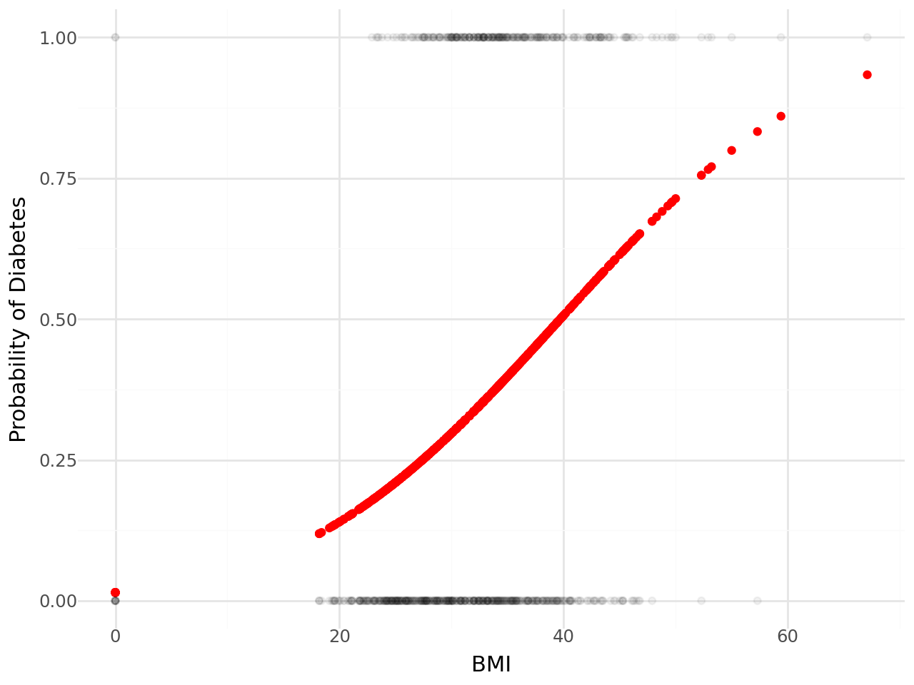
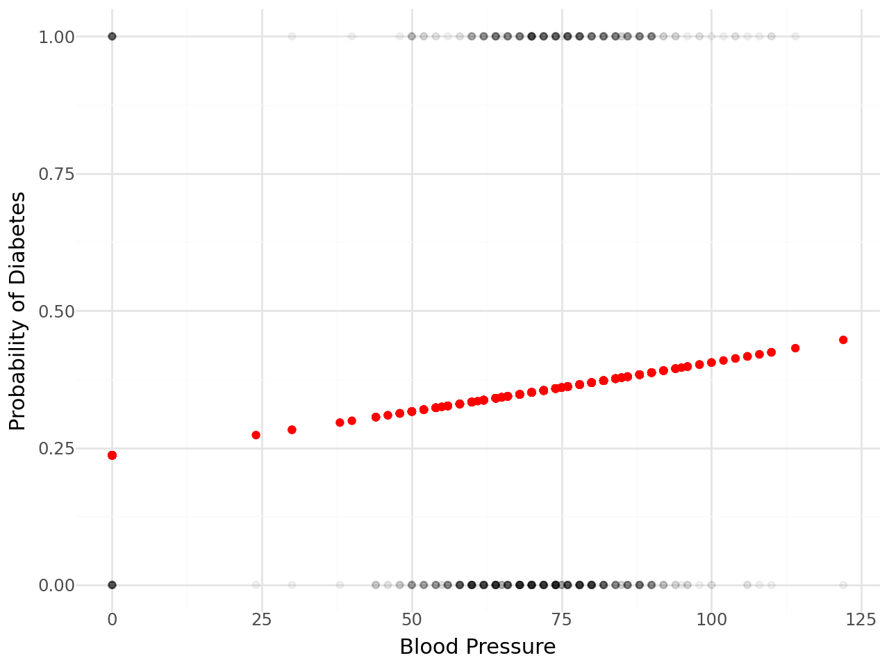

# Diabetes Prediction Project

## Introduction
This project aims to predict diabetes based on two selected variables (BMI and Blood Pressure) using logistic regression. The analysis includes the use of the Akaike Information Criterion (AIC) and Vuong test to evaluate the predictive performance of the models.

## Dataset
The dataset used in this project is available at Kaggle repository: https://www.kaggle.com/datasets/kandij/diabetes-dataset

## Variables
- **Predictors**: BMI and Blood Pressure
- **Response**: Diabetes status (binary outcome: 1 if diabetic, 0 if not).

## Methodology

1. **Model Building**: Logistic regression models were built using different packages (e.g., `lmfit`, `scikit-learn`) to predict diabetes based on the selected variables. It tests least squares optimization and negative log likelihood.
3. **Model Evaluation**:
   - **AIC (Akaike Information Criterion)**: Lower AIC values indicate better models.
   - **Vuong Test**: A statistical test used to compare the predictive performance of two models. It assesses whether one model significantly outperforms the other.

## Packages Used
- **lmfit**: Used for building and evaluating logistic regression models and computing AIC.
- **scikit-learn**: Utilized to test results.


## Results
Two figures are included below:

Figure 1: Logistic regression model with BMI



Figure 2: Logistic regression model with Blood Pressure



## Conclusion
BMI predicts better Diabetes than Blood pressure based on both AIC and Vuong test.
```
